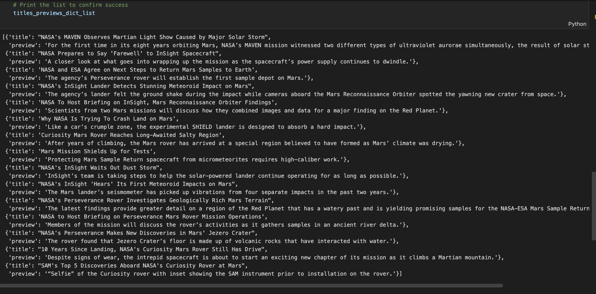
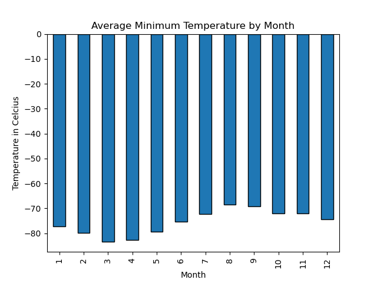
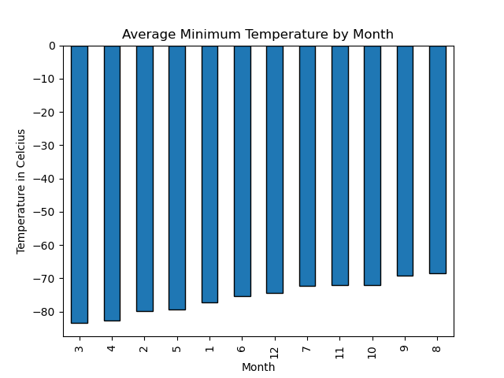
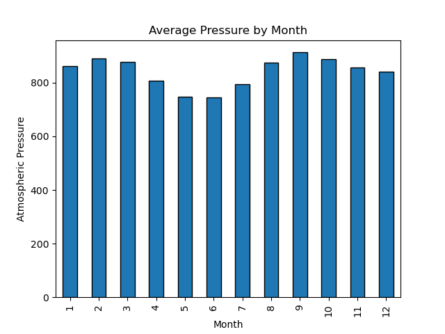
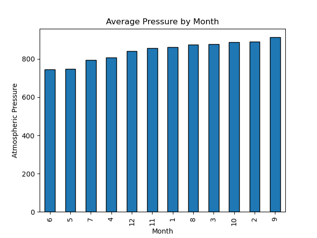
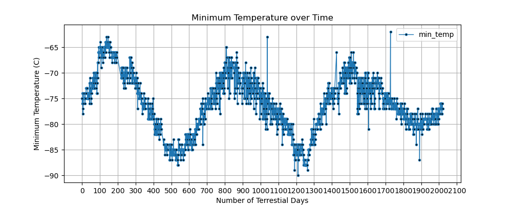
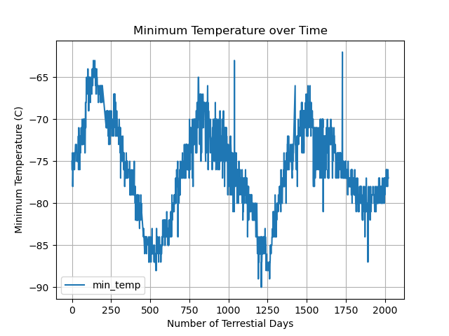

# web-scraping-challenge
- Module 11 Challenge
- Steph Abegg

## Files

In the main folder, I have included:

(1) Deliverable 1: Scrape titles and preview text from Mars news articles. [part_1_mars_news.ipynb](part_1_mars_news.ipynb).

(2) Deliverable 2: Scrape and analyze Mars weather data, which exists in a table. [part_2_mars_weather.ipynb](part_2_mars_weather.ipynb). 

(3) An [output](output) folder containing the various outputs from the analysis:

- [mars_news.json](output/mars_news.json) output json file from part 1. This file stores the scraped data in a file (to ease sharing the data with others). 

- [mars_weather_data.csv](output/mars_weather_data.csv) output csv file from part 2. This csv file contains the exported dataframe of weather data.

- Various graphical outputs from part 2 (shown in discussion below).

## Part 1 Analysis

For part 1, we stored each title-and-preview pair in a Python dictionary and printed the list in the notebook file. Here is a screenshot of the printed list:

 

## Part 2 Analysis

For part 2, we analyze the dataset by using Pandas functions to answer the following questions: 

---
Question: How many months exist on Mars? 

Answer: There are 12 months on Mars.

---
Question: How many Martian (and not Earth) days worth of data exist in the scraped dataset?

Answer: There are 1867 Martian days of data in the table.

---
Question: What are the coldest and the warmest months on Mars (at the location of Curiosity)? 

Answer:

 

On average, minimum tempearture on Mars is lowest in the third month and highest in the eighth month. In other words, the third month has the coldest minimum temperature on Mars, and the eighth month is the warmest.

But we can dive into this in a bit more detail. The bar chart for average minimum temperature by month, ordered by month, shows that the average minimum temperature by month roughly follows a sinusoidal pattern with a period of twelve months, with a valley around the third/fourth months and peak around the eighth/ninth months.

But the minimum temperatures are always between -70 to -80 degrees Celcius....brrr!

---
Question: Which months have the lowest and the highest atmospheric pressure on Mars? 

Answer:

 

On average, atmospheric pressure is lowest in the sixth month and highest in the ninth month. 

But we can dive into this in a bit more detail. The bar chart for average pressure by month, ordered by month, shows that the average atmospheric pressure by month roughly follows a sinusolidal pattern with a period of six months, with valleys on Month 6 and Month 12 and peaks on Month 3 and Month 9.

---
Question: About how many terrestrial (Earth) days exist in a Martian year? 

Answer:

 

We can use the graph of minimum temperature vs. terrestraial days to estimate the number of terrestrial days in a Martian year by looking at the peak-to-peak or trough-to-trough. The graph with the smaller horizntal:vertical aspect matches that in the Module Challenge description, but the graph that has a larger horizontal:vertical aspect ratio is more useful for measuring peak-to-peak and trough-to-trough.

Peak-to-Peak

830 - 140 = 690

1520 - 830 = 690

Trough-to-Trough

1230 - 540 = 690

So a year on Mars appears to be around 690 days. Internet search confirms that a Mars year is equivalent to 687 earth days.

## External Resources

For this challenge, I used the starter code and the techniques learned in class. I did not include any code snippits from outside resources.
